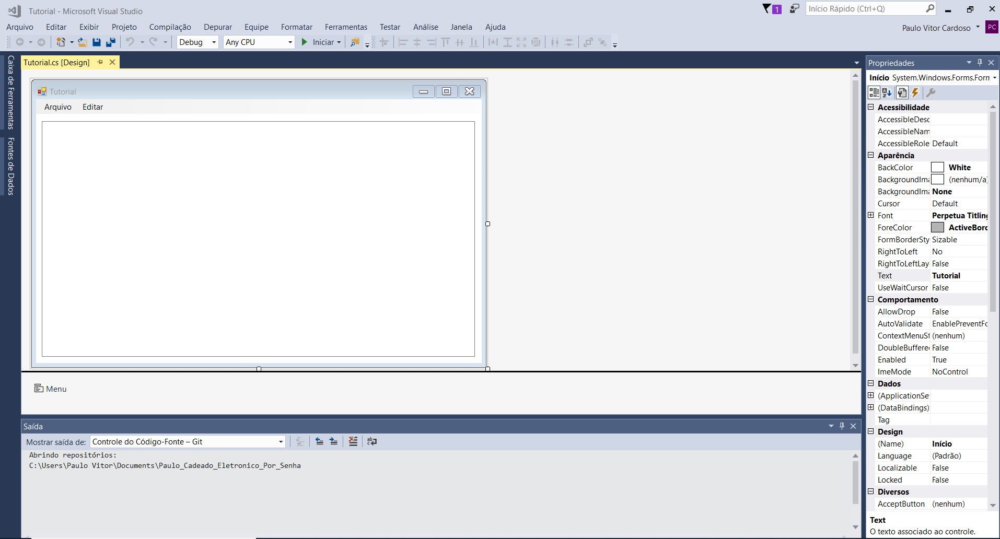

Conceito- Cadeado eletronico que será aberto por senha composta de dois digitos. O cadeado terá três botões, dois para os digitos da senha e um para confirmar a senha digitada e também fechar o cadeado. A senha será dividida em duas partes de 4 digitos.

Motivação- Eu estava precisando de um cadeado para o armário da sala. Portanto seria útil ter um por senha.

Tutorial: Usei o tutorial de Windows Forms para montagem de um modelo de Bloco de Notas, conforme site: https://www.youtube.com/watch?v=_vZ1vUWu4sQ

Foi gerado, assim, o seguinte:
<<<<<<< HEAD
=======

>>>>>>> 212dc4831f1c6603f570b24c490e9365d3e03464

Esboço GUI:

A janela possui três botões: Os dígitos '1' e '0' e o botão de confirmar 'Enter'.
No visor(retangulo branco) irá aparecer os 4 digitos da senha, seja primeira ou segunda parte, digitada.
Após apertar o botão de confirmar o visor irá apagar a senha e escrever em seu lugar se é correta ou não.
Por fim irá apagar essa mensagem também e irá esperar o próximo passo(pode ser a segunda parte da senha ou apaertar confirmar para fechar o cadeado)

