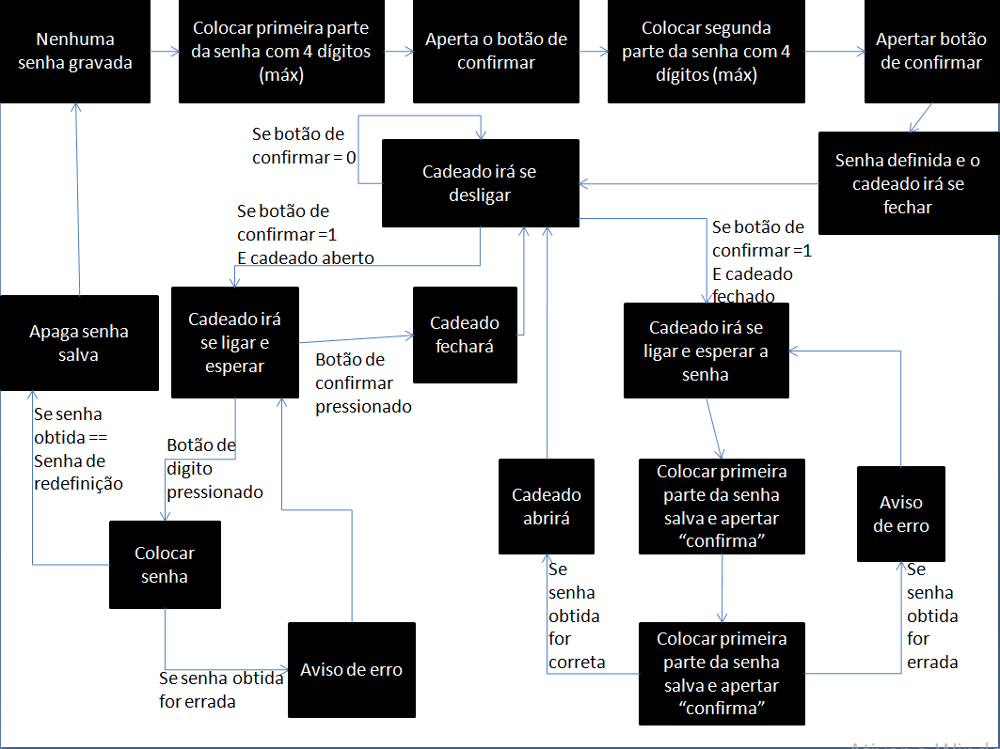
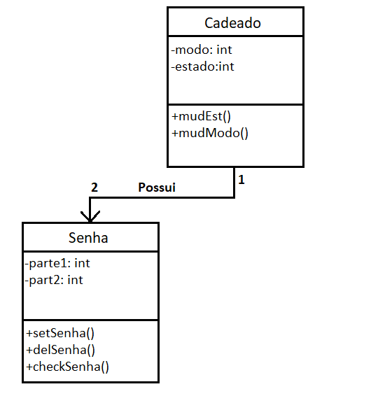
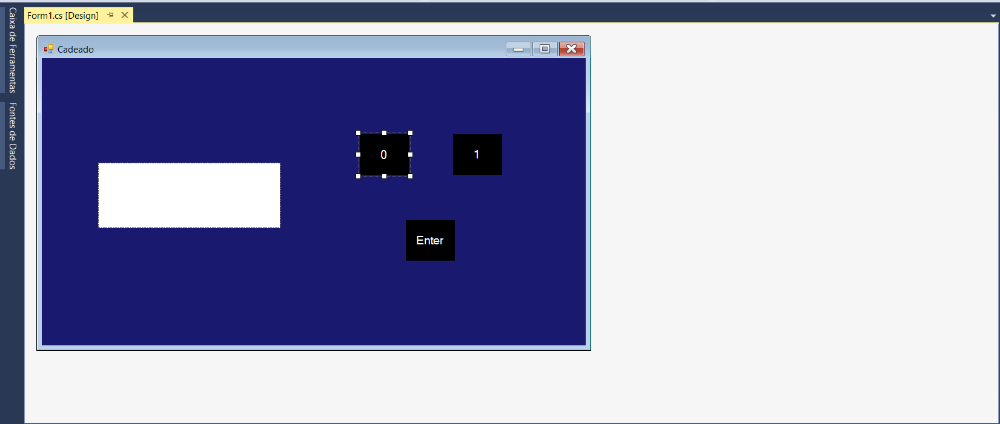

Conceito- Cadeado eletronico que será aberto por senha composta de dois digitos. O cadeado terá três botões, dois para os digitos da senha e um para confirmar a senha digitada e também fechar o cadeado. A senha será dividida em duas partes de 4 digitos.

Motivação- Eu estava precisando de um cadeado para o armário da sala. Portanto seria útil ter um por senha.

Fluxograma:

Diagrama de Classes:

Tutorial: Usei o tutorial de Windows Forms para montagem de um modelo de Bloco de Notas, conforme site: https://www.youtube.com/watch?v=_vZ1vUWu4sQ

Foi gerado, assim, o seguinte:

Esboço GUI:

A janela possui três botões: Os dígitos '1' e '0' e o botão de confirmar 'Enter'.
No visor(retangulo branco) irá aparecer os 4 digitos da senha, seja primeira ou segunda parte, digitada.
Após apertar o botão de confirmar o visor irá apagar a senha e escrever em seu lugar se é correta ou não.
Por fim irá apagar essa mensagem também e irá esperar o próximo passo(pode ser a segunda parte da senha ou apertar confirmar para fechar o cadeado)

Quanto a compilação:

-	O programa foi produzido e compilado utilizando Windows Forms no Visual Studios 2017. A compilação foi feita com o compilador do pacote do Visual Studios. É possível ter que alterar o endereço da imagem usada. No código está indicado com comentário esse aviso. A imagem usada encontra-se na pasta "Imagens/" com o nome "LED_Verde".
	
Quanto ao uso do programa:

-	O programa irá começar na definição de senha digite a senha de 8 digitos dividindo-a em duas partes de 4 digitos. O programa está preparado para casos de digitar a mais ou a menos do que o necessário, caso ocorra só apertar enter e digitar de novo, o programa irá resetar o valor salvo somente para parte com o excesso ou falta de digitos.
	Após definir a senha o cadeado irá ter duas senhas salvas: A criada, que será utilizada para abrir e fechar o cadeado, e a de Redefinição, senha compostas só por zeros que só pode ser usado com o cadeado aberto. O cadeado começa aberto e ligado, é possível saber se está ligado pelo "LED" verde abaixo do visor. Quando coloca sua senha o cadeado irá abrir, ou fechar, e desligar o cadeado. Com o cadeado desligado somente o botão "Enter" irá funcionar para liga-lo novamente. Apertar o botão "Enter" sem digitar algo irá limpar o visor.
